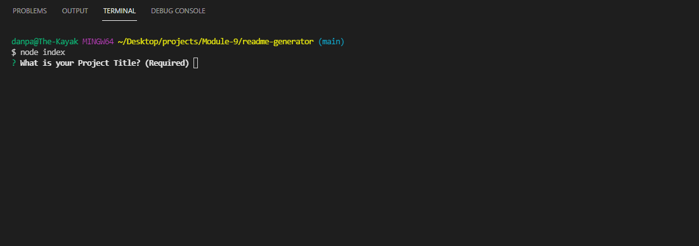
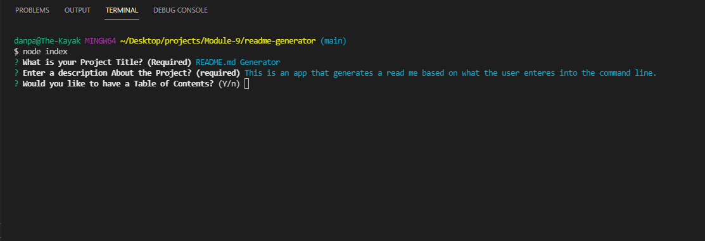
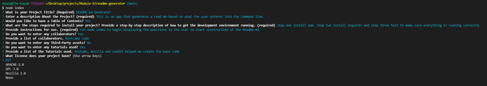
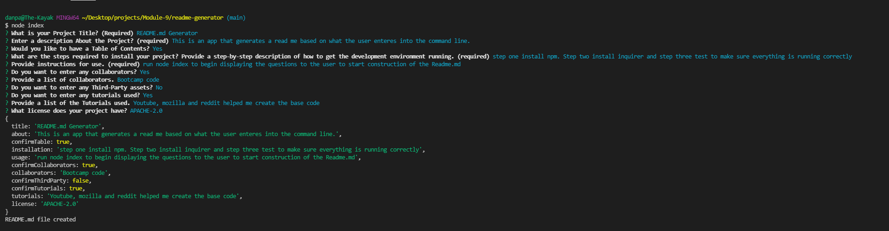

# 09 Node.js: Professional README Generator

Your task is to create a command-line application that dynamically generates a professional README.md file from a user's input using the [Inquirer package](https://www.npmjs.com/package/inquirer).

## Steps
* started off with the base code provided
* installed npm and inquirer
* created the questions for the user to be prompted with in the command line
* had the questions called once the app was run with node
* created the base function in index to write the README.md file
* created the initialization function to run the program
* created the base markdown function to display everything
* created the function to display a table of contents or not
* created the 3 functions to properly display the License

## Screenshots

## Display video
